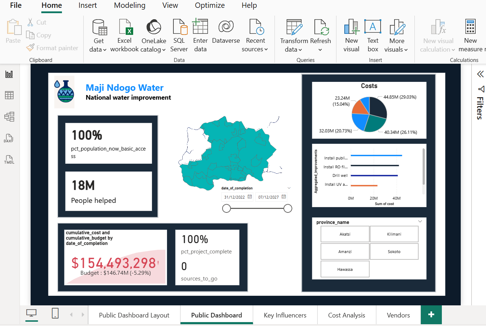
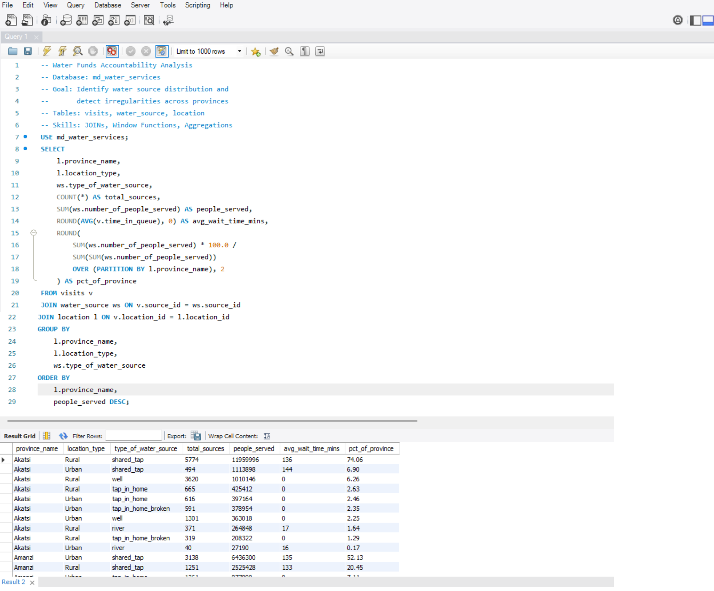
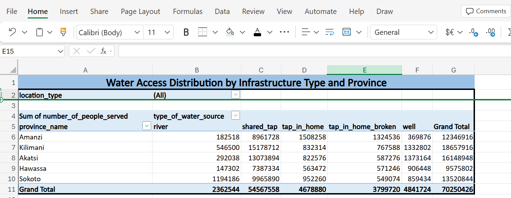

# Water Funds Accountability Dashboard

A data analysis project investigating financial irregularities in water infrastructure spending using SQL and Power BI.

## Project Overview

Maji Ndogo is a fictional region used as a simulated dataset by ExploreAI Academy, modelled on real water access challenges across Sub-Saharan Africa. This project investigates financial irregularities within that dataset, looking for patterns that could indicate fraud, misallocation, or corruption in public water spending.

## Live Portfolio Page

View the full case study at: [glorygakii.com/projects/water-access.html](https://glorygakii.com/projects/water-access.html)

## Tools Used

- MySQL Workbench
- Power BI
- Excel (Pivot Tables)
- SQL Window Functions

## Screenshots

### Power BI Dashboard


### SQL Analysis


### Excel Pivot Table Summary


## Database Tables

- Database: md_water_services
- Tables: water_source, location, visits

## Key SQL Techniques

- Multi-table JOINs across relational database
- Window functions: SUM() OVER, PARTITION BY, ORDER BY
- Aggregations: COUNT, SUM, AVG, ROUND
- Anomaly detection through statistical comparison

## Core Query

```sql
SELECT
    l.province_name,
    l.location_type,
    ws.type_of_water_source,
    COUNT(*) AS total_sources,
    SUM(ws.number_of_people_served) AS people_served,
    ROUND(AVG(v.time_in_queue), 0) AS avg_wait_time_mins,
    ROUND(
        SUM(ws.number_of_people_served) * 100.0 /
        SUM(SUM(ws.number_of_people_served))
        OVER (PARTITION BY l.province_name), 2
    ) AS pct_of_province
FROM visits v
JOIN water_source ws ON v.source_id = ws.source_id
JOIN location l ON v.location_id = l.location_id
GROUP BY l.province_name, l.location_type, ws.type_of_water_source
ORDER BY l.province_name, people_served DESC;
```

## Key Findings

- Identified sources with disproportionately high visit counts relative to population served
- Flagged employee records with irregular audit scores across multiple sites
- Summarised provincial water access patterns in an Excel pivot table
- Built a Power BI dashboard making findings accessible to non-technical stakeholders

## Author

Glory Gakii Mbiti — Data Scientist and BI Analyst based in Nairobi, Kenya

- Portfolio: [glorygakii.com](https://glorygakii.com)
- LinkedIn: [linkedin.com/in/glorygakii](https://linkedin.com/in/glorygakii)
- Email: [gakiimbiti6@gmail.com](mailto:gakiimbiti6@gmail.com)
